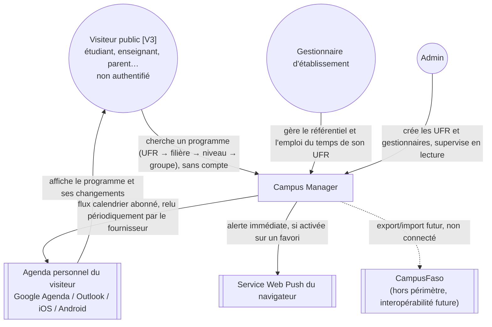
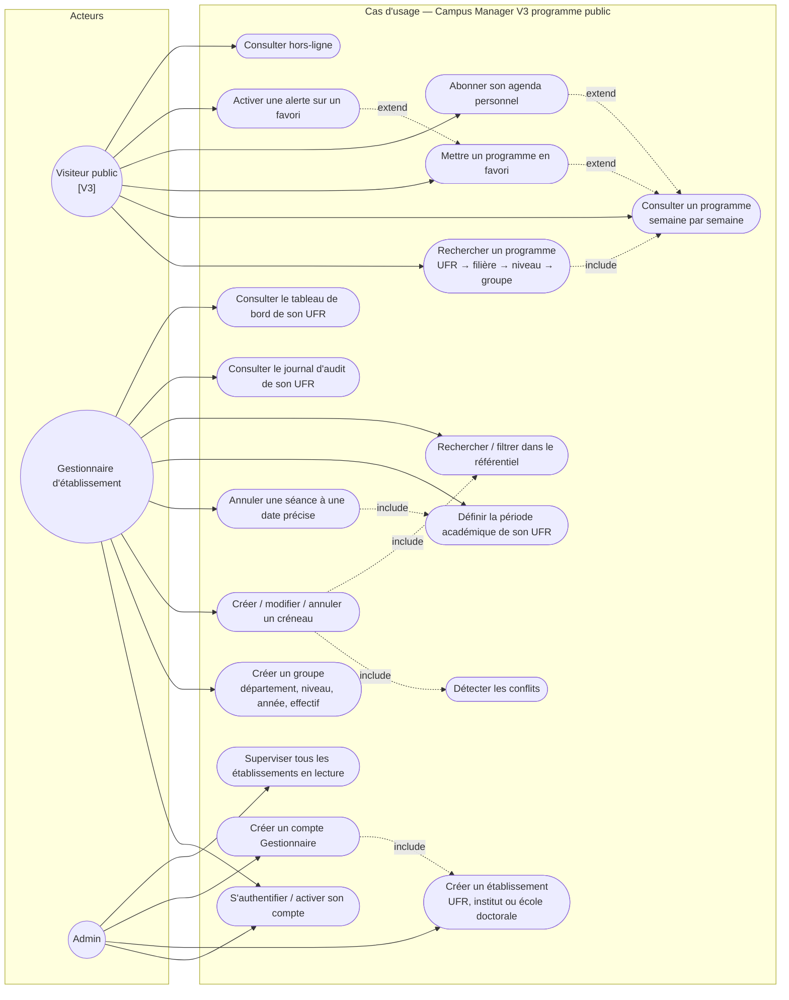
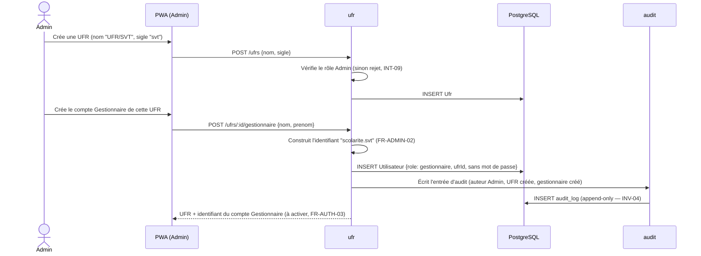
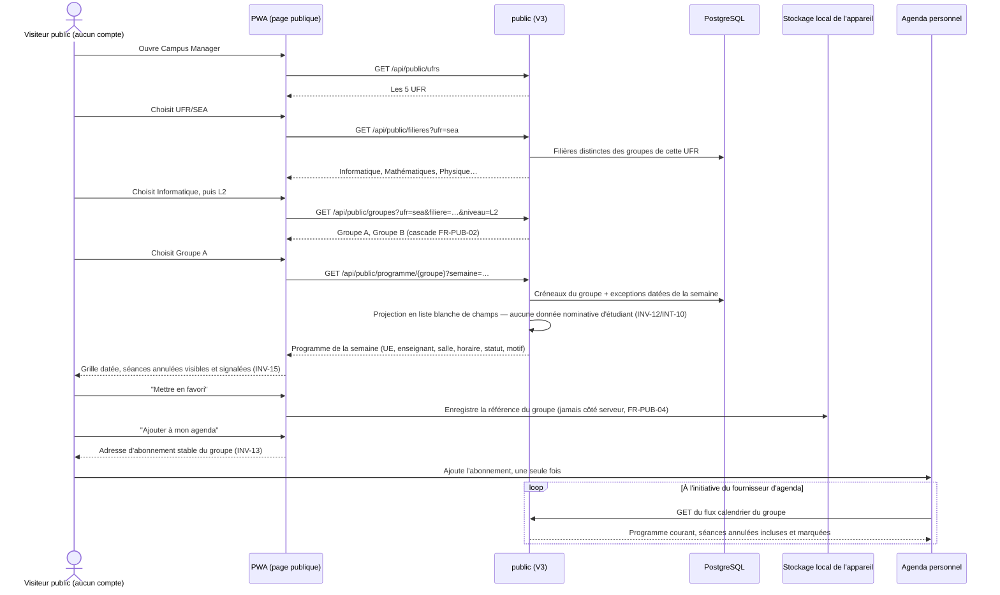
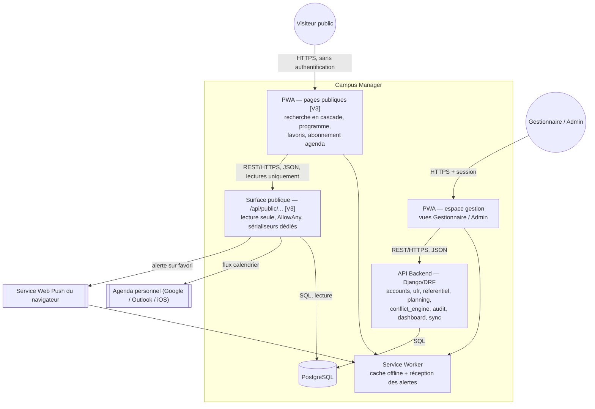
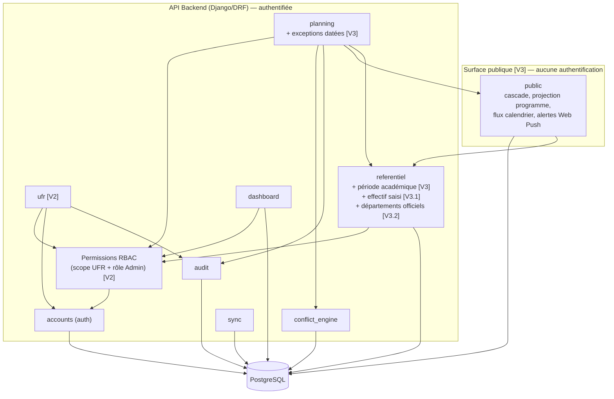

# Modélisation UML & C4 — Campus Manager

**Étape 5 de la chaîne méthodologique** — répond à : *comment le système se comporte-t-il, et comment est-il structuré pour supporter ce comportement ?*
Règle d'or respectée : le **comportement (UML)** est modélisé avant la **structure (C4)**. Ordre suivi : C4 Contexte → UML Cas d'usage → UML Séquence → C4 Conteneur → C4 Composant.

> **`[V3.2]` Révision du 2026-09-07.** Le périmètre passe de 5 UFR à **12 établissements** (5 UFR, 6 instituts, 1 école doctorale) et 53 départements. Dans les diagrammes, l'acteur « Gestionnaire d'établissement » devient « Gestionnaire d'établissement », et le composant `referentiel` porte désormais le référentiel des départements.

> **`[V3.1]` Révision du 2026-09-07 (même journée).** Le référentiel nominatif des étudiants est supprimé : l'effectif d'un groupe est un nombre saisi. Disparaissent des diagrammes ci-dessous : les cas d'usage « Importer le référentiel académique », « Télécharger le canevas d'import », « Filtrer les étudiants » et « Transférer un étudiant vers une autre UFR ». Apparaît à leur place « Déclarer l'effectif d'un groupe ».

> **`[V3]` Révision du 2026-09-07.** Les diagrammes ci-dessous sont ceux de la V3 (programme public, cf. `01_PRD` note 2026-09-07). Trois changements les traversent tous : les acteurs **Étudiant** et **Enseignant** sont remplacés par un unique **Visiteur public** non authentifié ; le composant `demandes` et le composant `notifications` disparaissent au profit d'un composant **`public`** ; et le canal **SMS** disparaît au profit de l'**agenda personnel** et d'une alerte navigateur. Les noms de composants sont également passés de la forme NestJS à la forme Django, conformément à la rectification de stack notée dans `04_Exigence_Architecture_Campus_Manager.md`.

---

## 1. C4 — Niveau Contexte

*Où s'inscrit le système ? Qui lui parle, quels systèmes externes touche-t-il ?*



> **Ce que ce diagramme dit de neuf.** Le système n'a plus de population d'utilisateurs à connaître du côté consultation : la flèche entrante ne part plus d'un compte mais d'un anonyme. Et surtout, une flèche **sortante** apparaît vers un système que Campus Manager ne contrôle pas — l'agenda du visiteur. C'est le premier point du système où la donnée quitte durablement le périmètre et vit sa vie ailleurs, au rythme de rafraîchissement d'un tiers (cf. `02_SRS` FR-NOTIF-05).

## 2. UML — Cas d'usage

*Quelles fonctionnalités sont dans le périmètre du MVP ?* (dérivé directement du SRS §2)



> **Cas d'usage retirés en V3.1** : ~~« Importer le référentiel académique de son UFR »~~, ~~« Télécharger le canevas d'import »~~, ~~« Filtrer les étudiants par année/filière »~~ et ~~« Transférer un étudiant vers une autre UFR »~~ — le référentiel nominatif des étudiants n'existe plus (cf. `01_PRD`, note V3.1). « Créer un groupe » les remplace : c'est là que l'effectif est déclaré, en un nombre.
>
> **Cas d'usage retirés en V3** — conservés ici en clair pour la traçabilité : ~~« S'authentifier / activer son compte » pour l'Étudiant et l'Enseignant~~ (plus de comptes), ~~« Consulter l'emploi du temps de son groupe »~~ et ~~« Consulter son planning personnel »~~ (fusionnés dans « Consulter un programme », désormais ouvert à tous), ~~« Signaler une absence / demander un report »~~, ~~« Suivre le statut d'une demande »~~ et ~~« Valider une demande enseignant »~~ (circuit de demandes retiré, `02_SRS` §2.7).
>
> Le déplacement le plus notable est celui de UC21 (« Rechercher / filtrer ») : ce n'est pas un cas d'usage de confort ajouté en marge, il est en relation `include` avec UC8 (« Créer / modifier un créneau »). Construire un créneau **suppose** de retrouver la salle et le cours — c'est ce qui justifie que la recherche vive aussi dans le formulaire de créneau et pas seulement dans les écrans de référentiel (`02_SRS` FR-FILT-04).

## 3. UML — Diagramme de séquence

*Sur la fonctionnalité la plus complexe : modification d'un créneau en conflit, avec dérogation et notification.* Ce flux est celui qui engage le plus d'invariants à la fois (INT-03, INV-02, INV-04, INV-06, FR-NOTIF-01) — c'est pourquoi il est choisi plutôt qu'un cas simple.

```mermaid
sequenceDiagram
    actor Sco as Gestionnaire de scolarité (UFR X)
    participant UI as PWA (Gestionnaire)
    participant RG as RBAC Guard
    participant PM as planning
    participant CE as conflict_engine
    participant DB as PostgreSQL
    participant AU as audit
    participant PB as public (V3)
    participant SW as Service Worker (Visiteur abonné)
    participant AG as Agenda personnel du visiteur

    Sco->>UI: Modifie le créneau (nouvelle salle, motif)
    UI->>PM: PATCH /creneaux/:id {salle, motif}
    PM->>RG: Le créneau appartient-il à l'UFR du Gestionnaire ?
    RG-->>PM: OK (sinon rejet, INT-07) [V2]
    PM->>PM: Vérifie que le motif n'est pas vide (INT-03)
    PM->>CE: Évalue les conflits (salle, enseignant, groupe, capacité)
    CE->>DB: Requête de chevauchement (contrainte EXCLUDE)
    DB-->>CE: Conflit bloquant détecté (Amphi A, 08h-10h)
    CE-->>PM: Conflit bloquant + détail
    PM-->>UI: Retourne l'alerte de conflit
    UI-->>Sco: Affiche "Conflit bloquant — Corriger / Dérogation"
    Sco->>UI: Confirme avec motif de dérogation
    UI->>PM: PATCH /creneaux/:id {motif_derogation}
    PM->>DB: Enregistre le créneau modifié
    PM->>AU: Écrit l'entrée d'audit (auteur, date, motif, dérogation)
    AU->>DB: INSERT audit_log (append-only — INV-04)
    PM->>PM: Incrémente le compteur de révision du créneau (INV-13/FR-PUB-06)
    PM->>PB: Publie l'événement "créneau modifié"
    PB->>SW: Alerte immédiate aux visiteurs abonnés à ce groupe (FR-PUB-08)
    Note over PB,AG: Le flux calendrier du groupe est<br/>désormais à jour ; l'agenda du visiteur<br/>le relira à SON rythme (FR-NOTIF-05)
    AG->>PB: Relecture périodique du flux (déclenchée par le fournisseur, pas par nous)
    PB-->>AG: Séance marquée MODIFIÉE, motif inclus, jamais omise (INV-15)
```

> **`[V3]` Ce que ce flux perd et ce qu'il gagne.** Il perd l'étape « résoudre les destinataires » : il n'y a plus de liste d'étudiants et d'enseignants à retrouver en base pour savoir qui prévenir — le programme publié *est* le message, et quiconque le regarde reçoit l'information. Il gagne en revanche une asymétrie qui n'existait pas : la dernière flèche n'est plus déclenchée par nous mais **par l'agenda du visiteur**, ce qui rend le délai final hors de notre contrôle. C'est exactement la raison d'être de l'alerte de FR-PUB-08, seule branche du diagramme qui reste, elle, sous notre maîtrise.

### 3bis. UML — Diagramme de séquence : création d'une UFR et de son Gestionnaire `[V2]`

*Second flux ajouté au passage multi-UFR : c'est celui qui engage le plus les nouveaux invariants (INT-09, INV-10) — la seule porte d'entrée pour faire exister une nouvelle UFR dans le système.*



### 3ter. UML — Diagramme de séquence : consultation publique et abonnement agenda `[V3]`

*Troisième flux, ajouté par la V3 : c'est désormais le chemin le plus emprunté du système, et le seul ouvert sur l'extérieur. Il engage les invariants nouveaux (INV-05 élargi, INV-12, INV-13, INT-10) et n'a aucune étape d'authentification — c'est précisément ce qui le rend digne d'être modélisé.*



> **Le point de vigilance de tout ce diagramme** tient en une ligne : `public` construit **ses propres** représentations à partir du modèle, au lieu de réutiliser celles de `planning` ou `referentiel`. Réutiliser serait plus court, et c'est précisément le raccourci qui ferait fuiter, six mois plus tard, un champ ajouté innocemment à un sérialiseur partagé — sur une surface qui, elle, est ouverte à Internet (cf. `04` ligne 20).

## 4. C4 — Niveau Conteneur

*Quels services existent, et comment communiquent-ils ?*



> **`[V3]` Pourquoi deux surfaces plutôt qu'une API avec un filtre de plus.** La surface publique est dessinée comme un conteneur logique distinct, alors qu'elle s'exécute dans le même processus Django. Ce n'est pas une coquetterie de diagramme : elle a une politique d'authentification opposée (`AllowAny` au lieu du défaut `IsAuthenticatedCM`), ses propres représentations de données, et aucune route d'écriture. Les tenir visuellement séparées est ce qui rend visible, à la relecture, toute route qui aurait glissé du mauvais côté de la frontière.

## 5. C4 — Niveau Composant

*Zoom sur l'API Backend (NestJS) — reprend directement les modules identifiés à l'étape 4 (`04_Exigence_Architecture_Campus_Manager.md`).*



> **`[V3]` Deux composants disparaissent, un apparaît.** ~~`demandes`~~ (ex-`RequestModule`) est supprimé avec le circuit de demandes ; ~~`notifications`~~ est supprimé faute de destinataire nominatif — sa responsabilité de diffusion est reprise par `public`. La flèche `planning → public` est la seule qui traverse la frontière, et elle ne va que dans ce sens : `public` ne peut rien demander à `planning`, il lit la base en lecture seule. **`public` ne dépend jamais de `Guard`** — c'est volontaire et c'est ce qui doit sauter aux yeux : ce composant ne connaît aucun utilisateur, donc il ne peut pas se tromper sur les droits de quelqu'un ; en contrepartie, il ne doit jamais exposer que ce qui est publiable par construction (INV-12).

## 6. C4 — Niveau Code

Volontairement **non modélisé** à ce stade (niveau optionnel du C4). Chaque application ci-dessus émerge en structure Django standard (View → Service → Model) au moment du code ; les diagrammes de classes détaillés n'apporteraient rien que la table de l'étape 4 ne dise déjà.

---

## Traçabilité complète

Chaque composant apparu dans ces diagrammes est retraçable jusqu'à une responsabilité (étape 4) → une garantie (étape 3) → une exigence (étape 2) → un problème réel du PRD (étape 1). C'est cette chaîne, et non le code, qui doit rester stable si la stack technique change.

---

*Document d'ingénierie — Étape 5/5, révision V3 du 2026-09-07. Le code (Django/DRF + PostgreSQL + PWA Next.js) s'appuie sur `04_Exigence_Architecture_Campus_Manager.md` pour la découpe en applications.*
