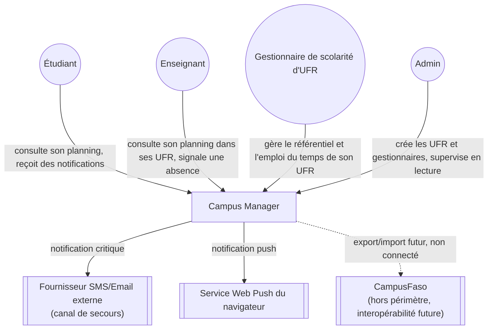
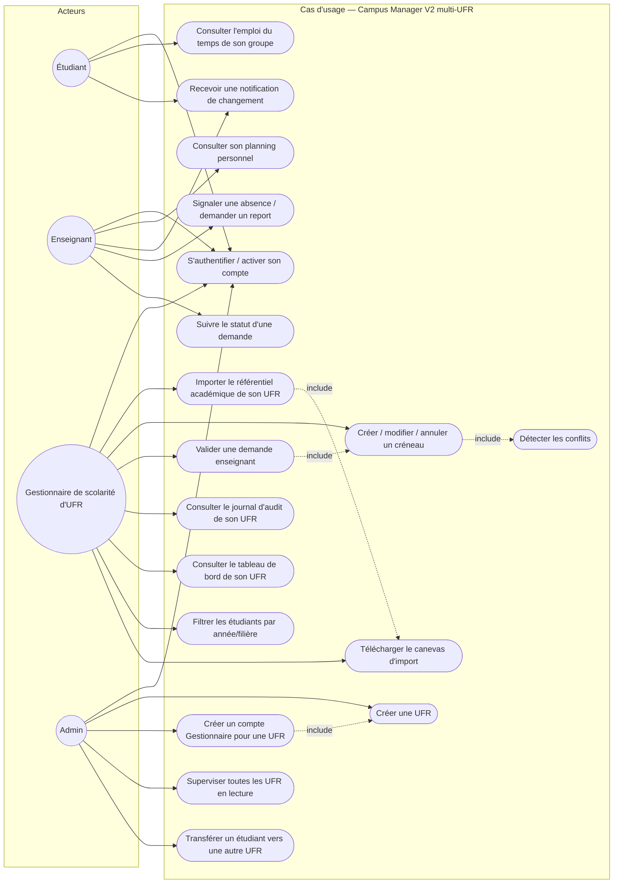
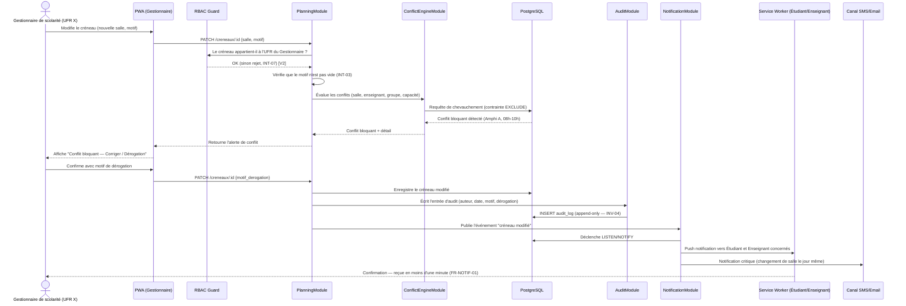
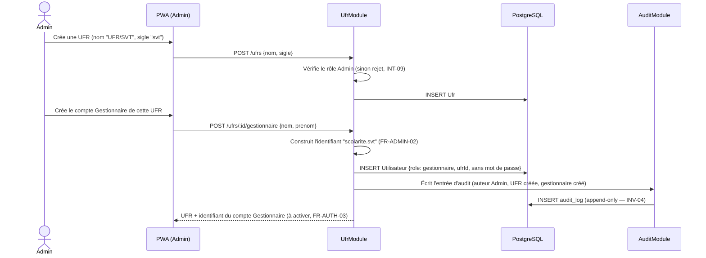
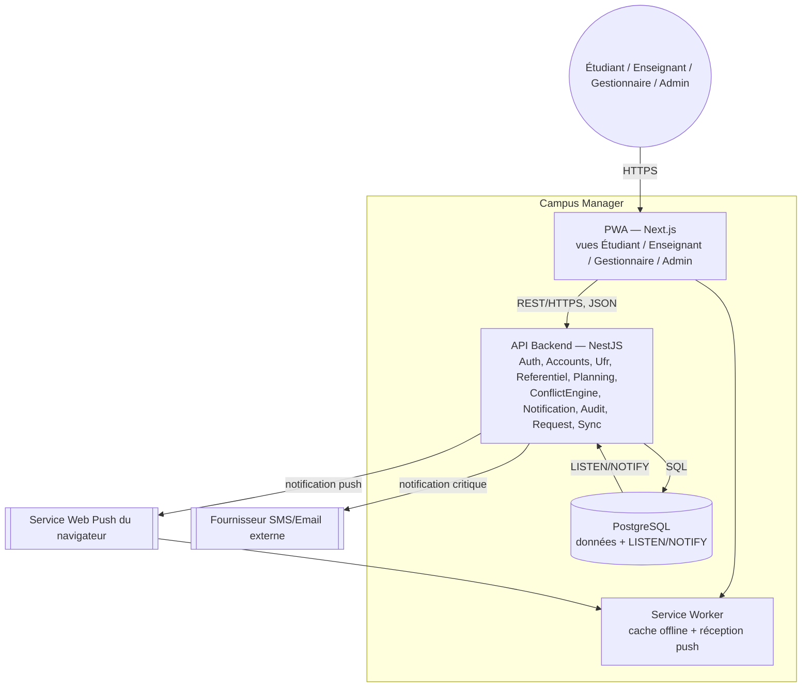
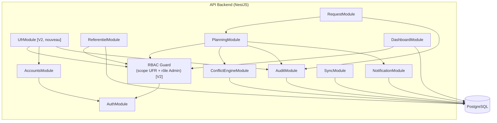

# Modélisation UML & C4 — Campus Manager

**Étape 5 de la chaîne méthodologique** — répond à : *comment le système se comporte-t-il, et comment est-il structuré pour supporter ce comportement ?*
Règle d'or respectée : le **comportement (UML)** est modélisé avant la **structure (C4)**. Ordre suivi : C4 Contexte → UML Cas d'usage → UML Séquence → C4 Conteneur → C4 Composant.

---

## 1. C4 — Niveau Contexte

*Où s'inscrit le système ? Qui lui parle, quels systèmes externes touche-t-il ?*

## 2. UML — Cas d'usage

*Quelles fonctionnalités sont dans le périmètre du MVP ?* (dérivé directement du SRS §2)

## 3. UML — Diagramme de séquence

*Sur la fonctionnalité la plus complexe : modification d'un créneau en conflit, avec dérogation et notification.* Ce flux est celui qui engage le plus d'invariants à la fois (INT-03, INV-02, INV-04, INV-06, FR-NOTIF-01) — c'est pourquoi il est choisi plutôt qu'un cas simple.

### 3bis. UML — Diagramme de séquence : création d'une UFR et de son Gestionnaire `[V2]`

*Second flux ajouté au passage multi-UFR : c'est celui qui engage le plus les nouveaux invariants (INT-09, INV-10) — la seule porte d'entrée pour faire exister une nouvelle UFR dans le système.*

## 4. C4 — Niveau Conteneur

*Quels services existent, et comment communiquent-ils ?*

## 5. C4 — Niveau Composant

*Zoom sur l'API Backend (NestJS) — reprend directement les modules identifiés à l'étape 4 (`04_Exigence_Architecture_Campus_Manager.md`).*

## 6. C4 — Niveau Code

Volontairement **non modélisé** à ce stade (niveau optionnel du C4). Chaque module ci-dessus émergera en classes/interfaces NestJS standard (Controller → Service → Repository) au moment du code ; les diagrammes de classes détaillés n'apporteraient rien que la table de l'étape 4 ne dise déjà.

---

## Traçabilité complète

Chaque composant apparu dans ces diagrammes est retraçable jusqu'à une responsabilité (étape 4) → une garantie (étape 3) → une exigence (étape 2) → un problème réel du PRD (étape 1). C'est cette chaîne, et non le code, qui doit rester stable si la stack technique change.

---

*Document d'ingénierie — Étape 5/5, fin de la chaîne méthodologique. Le code (NestJS + PostgreSQL + PWA) peut maintenant commencer, en s'appuyant sur `04_Exigence_Architecture_Campus_Manager.md` pour la découpe en modules.*
